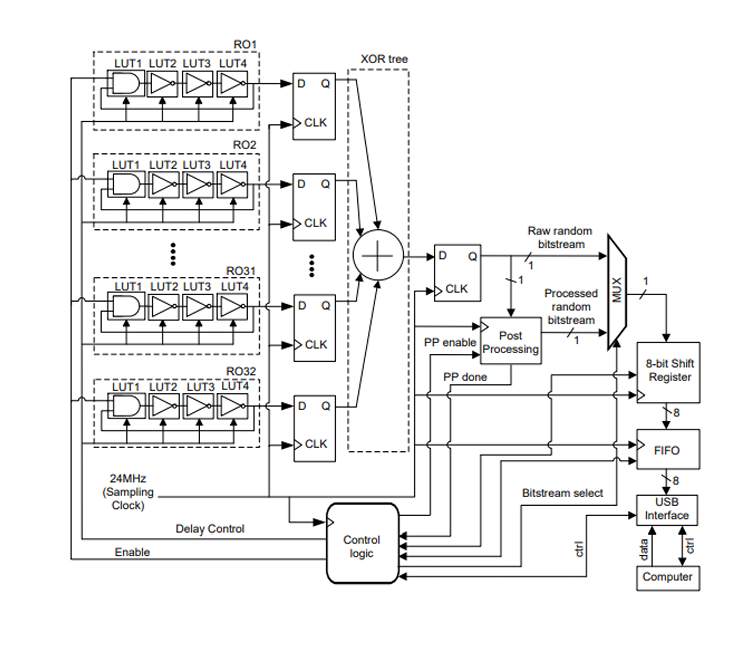

# TRUE-RANDOM-NUMBER-GENERATOR-USING-FPGA-AND-ASIC-
Hardware based TRNG using a noise entropy source and von neumann debiasing.use a ring oscillator or metatsable latch for entropy source and apply von neumoan extractor. output only bits from 01 or 10 sequence. Implementation and evaluation via FPGA AND ASIC

This project implements a **hardware-based True Random Number Generator (TRNG)** using ring oscillators on a Xilinx Spartan-7 FPGA 
The TRNG exploits clock jitter from multiple ring oscillators, uses XOR trees to combine entropy, and applies **Von Neumann debiasing** to produce a statistically unbiased random bitstream. Both **8-bit** and **32-bit** versions of the TRNG were implemented on FPGA  and evaluated Area,Power and Timing in FPGA & ASIC

## 🔧 System Block Diagram

